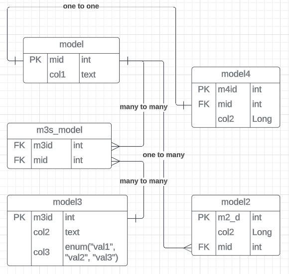
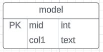

# How This was implemented

You can make full use of this template but say you need to understand how we went about creating it, here was the process

Refer to the [ReadMe](./README.md) file for the process of initializing the spring boot application

The ERD diagram below is generic and the names and values were replaced.

  

## Generating Our Tables JPA

Our ERD diagram has multiple types of relationships namely:
- one to one,
- one to many,
- many to many

But before that let us generate the table with no foreign key - let us assume the model table has no  relationship 
 

### Generating Tables
- Generate the package called model/s
- Generate a file called modelName - in this case our file will be called Model.java

Add the following annotations

    @Entity
    @Table(name = "table")

Example in code

    // Imports placed here

    @Entity
    @Table(name = "table")
    public class model {  

        // table column values

        // constructor

        // getters and setters

    }

Refer to the [model example](../template/src/main/java/com/template/example/models/Model.java) itself for the real code.

How you create the primary key column

    @Id
    @GeneratedValue(strategy = GenerationType.IDENTITY)
    private long id; 

How you Create the other column.

    @Column(name = "title")
    private String title;

[Refer](https://github.com/DidIrb/spring-boot-user-guide-service/blob/master/GeneratingTables.md) to this file for more information

### CRUD Operations

#### Repository

Create, Read, Update, Delete Requests, is an acronym for CRUD, Using JPA, to do crud operations in our model, table.

- Generate the package called repository/s
- Generate a file called repositoryName - in this case our file will be called ModelRepository.java

Define our model repository Like so,[ refer here](../template/src/main/java/com/template/example/repository/ModelRepository.java).

    // imports here

    public interface ModelRepository extends JpaRepository<Model, Long> {
        // custom methods placed here
        // eg
        // The method below will generate a list of type Model
        List<Model> findByCol
        1(String col
        1);
        // it will make a request to the database 
        // checking if the column, col
        1 has a value passed in the controller
    }

By extending jpa we will be able to use their methods eg, find, create, delete, etc and even the custom methods we defined.

#### Controllers

In our controllers we define our endpoint and map it to the right method, we can do all sorts of operations from post to patch to delete, in this example we will cover how we use controllers.

- Generate the package controller/s
- Generate our controllerName file in this case our file is called

Structure of our controller

    // Imports here
    @CrossOrigin(origins = "http://localhost:5678")
    @RestController
    @RequestMapping("/api")
    public class ModelController {

        // add our repositories to access jpa methods

        // mapping our requests 
    }

Adding our repositories

    // add our repositories to access jpa methods
    @Autowired
    ModelRepository modelsRepository;

    // Using the modelsRepository we can access 
    // the methods availed to us in it

Manipulating the data in our database through the controller,
we can use post, patch, delete, put and get to map our requests appropriately

##### Create Request

post can be used for this whenever there is a post request to the end point specified our application will run the method specified

    @PostMapping("/model")
    public ResponseEntity<Models> 
    addUser(@RequestBody Models modelRequest) {
        // Persist the data through the repository
        Models models = modelRepository.save(modelRequest);
        // use a custom success message
        return new ResponseEntity<>(models, HttpStatus.CREATED);
    }

##### Read Request
Below is a code snippet of how get works

    @GetMapping("/model")
    public ResponseEntity<List<Models>> getAllModel
    (@RequestParam(required = false) String col1) {
        // Create new array and store it in a list
        List<Models> ModelData = new ArrayList<Models>();
        
        // Get data

        // checking if the table is empty and returning message
        // return a message
        return new ResponseEntity<>(ModelData, HttpStatus.OK);
    }

##### Update Requests

    @PutMapping("/model/{mid}")
    public ResponseEntity<Models> 
    updateUser(@PathVariable("mid") long mid, 
    @RequestBody Models modelRequest) {
        
        // check if model column with specified id exists
        Models _model = modelRepository.findById(mid)
                .orElseThrow(() -> new ResourceNotFoundException
                ("The item with the id : " + mid + " Was not found!!"));
        // Setting the data in the object
        _model.setCol1(modelRequest.getCol1());

        //return message
        
    }

#### Note to self
    Note we are currently using an exception I found in a tutorial 
    we will come later to create a custom error handler.

Read on how to create relationships between tables [here](./Relationships.md)