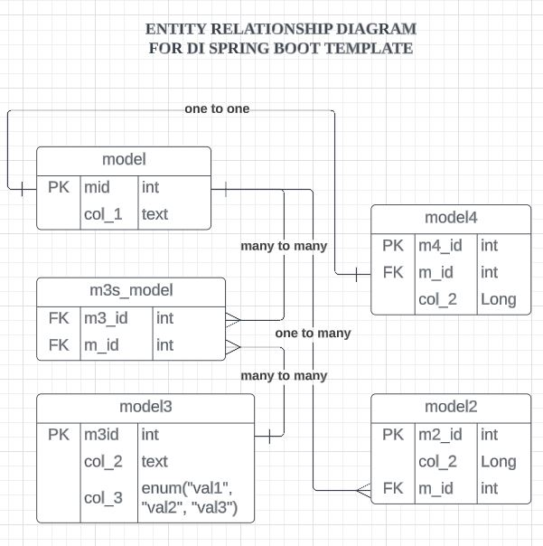

# DI Spring Boot Template 
This is a template is meant to shorten the amount of time it takes to develop our applications
It covers the following topics,

- Making connection with a database
- Generating tables through models
- Handling CRUD operations
- Handling errors - exceptions 
- Controllers
- Repositories.

## Template content

The template is based on an ERD diagram that has all 3 types of relationships 1-1, 1-many, many-many.

Below is an ERD diagram that was implemented in this template

  

## Getting Started

Before you start, you need to set up the development environment, you do this by:

- Installing Java JDK - [Refer Here](https://download.oracle.com/java/17/latest/jdk-17_windows-x64_bin.msi)
- Installing an IDE, VS Code [Download Here](https://code.visualstudio.com/), IntelliJ IDEA [Download Here](https://www.jetbrains.com/idea/)

I Prefer using VS Code but it needs a bit of configuration follow these steps to:
- Extension Pack for Java.
- Spring Boot Extension Pack.

Once you install these extensions now you can clone this repository

Clone this template branch from our repository

    git clone --single-branch -b template https://github.com/DidIrb/backend-springboot-reference.git

Run the application and play around with the code

