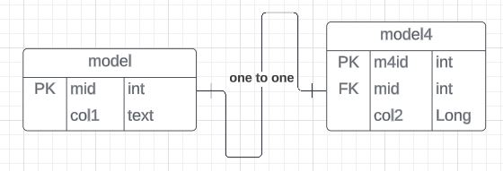

# Relationships
Read the previous [document](./Process.md)

There are different types of relationships as define, we will cover how we can write our models in order to make these relationships.

We use models to define the structure of our tables
What defines relations between tables are the foreign key constraints in our tables, below is a code snippet for foreign keys

    @OneToOne(fetch = FetchType.LAZY)
    @MapsId
    @JoinColumn(name = "fkColumnName")
    private Model model;

## One to one 
Tables can have relationships between each other in the example ERD diagram our model has a one to one relationship with the model4 table.

This means that a model4 table Column can only be related to one column in the model table.

 

### Generating table

Define the model layout [ Refer here](./src/main/java/com/template/example/models/Model4.java)

    // Primary key
    // Other columns
    
    // FK column
    @OneToOne(fetch = FetchType.LAZY)
    @MapsId
    @JoinColumn(name = "mid") // FK
    private Models models; // variable to store models data

    // Default constructor
    public Model4() {

    }
    // Constructor

    public Model4(String col2) {
        this.col2 = col2;
        // we do not add FK column in our constructor
    }

    // Getters and Setters

#### CRUD operations

Create our repository, Extend JPARepository, Add custom methods inside

    imports

    public interface Model4Repository 
    extends JpaRepository<Model4, Long> {
        // Custom methods _ causes errors.
    }
Add the methods to perform CRUD operations

    // Other operations
    

[Refer here ](./src/main/java/com/template/example/controllers/Model4Controllers.java)to see the code work in our controllers

### One to Many
In the example ERD diagram below our models have a one to many relationships.

This means that many rows in the table model2 can belong to one row in the model table (confusing right!!) well think of it like this lets replace the table model with name father and model2 with name children.

so a child can only have one father but a father can have many children, in our tables the fathers foreign key is referenced in every record, specifying who the father is.
 

### Generating table

Define the model layout [Refer here](./src/main/java/com/template/example/models/Model4.java)

    // Primary key
    // Other columns
    
    // FK column
    @ManyToOne(fetch = FetchType.LAZY, optional = false) 
    // Specifying that we many comments can belong to one tutorial
    @JoinColumn(name = "tutorial_id", nullable = false) 
    // Foreign key column value
    @OnDelete(action = OnDeleteAction.CASCADE) 
    // Telling the db what to do when you delete
    @JsonIgnore
    private Tutorial tutorial; 
    // importing and storing it in variable

    // Default constructor
    public Model2() {

    }
    // Constructor

    public Model2(String col2) {
        this.col2 = col2;
        // we do not add FK column in our constructor
    }

    // Getters and Setters

#### CRUD operations
Create the repository

Generate the controller and add the code shown [here]()

### Many to Many 

when dealing with many to many relationships to avoid empty fields in our database we create a join table.

 

Lets get started
generate the model3 table through model

say you have two tables  that is 

    Define the following in one table  

    // PK
    // Other tables
    @ManyToMany(fetch = FetchType.LAZY,
        cascade = {
            CascadeType.PERSIST,
            CascadeType.MERGE
        },
        mappedBy = "tags")
    @JsonIgnore
    private Set<Tutorial> tutorials = new HashSet<>();

    // constructors
    // getters and setters
    // also add a

And add this to another table

    @ManyToMany(fetch = FetchType.LAZY, cascade = {
        CascadeType.PERSIST,
        CascadeType.MERGE
    })
    @JoinTable(name = "tutorial_tags", joinColumns = { 
        @JoinColumn(name = "tutorial_id") }, inverseJoinColumns = {
            @JoinColumn(name = "tag_id") })
    private Set<Tag> tags = new HashSet<>();

    // YOU ALSO MUST ADD THIS CONSTRUCTOR IN YOUR MODEL
     
    public void addTag(Tag tag) {
            this.tags.add(tag);
            tag.getDocuments().add(this);
    }

### NOTE

In order to implement the a datatype of enum, follow the process:

generate enumTypes package
generate the columnTypes.java file 
write this code in it

    public enum Col3Types {
        Val1,Val2,Val3
    }

Refer to the files listed below:

- [models3](./src/main/java/com/template/example/models/Model3.java)
- [models](./src/main/java/com/template/example/models/Models.java)
- [modelsController](./src/main/java/com/template/example/controllers/ModelControllers.java)
- [model3Controller](./src/main/java/com/template/example/controllers/Models3Controllers.java)
- [modelsRepository](./src/main/java/com/template/example/repository/ModelsRepository.java)
- [model3Repository](./src/main/java/com/template/example/repository/Model3Repository.java)

